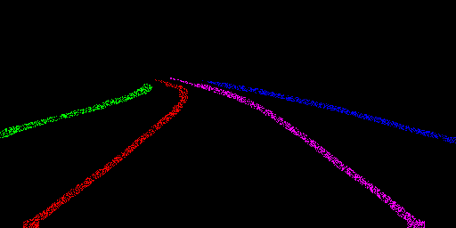
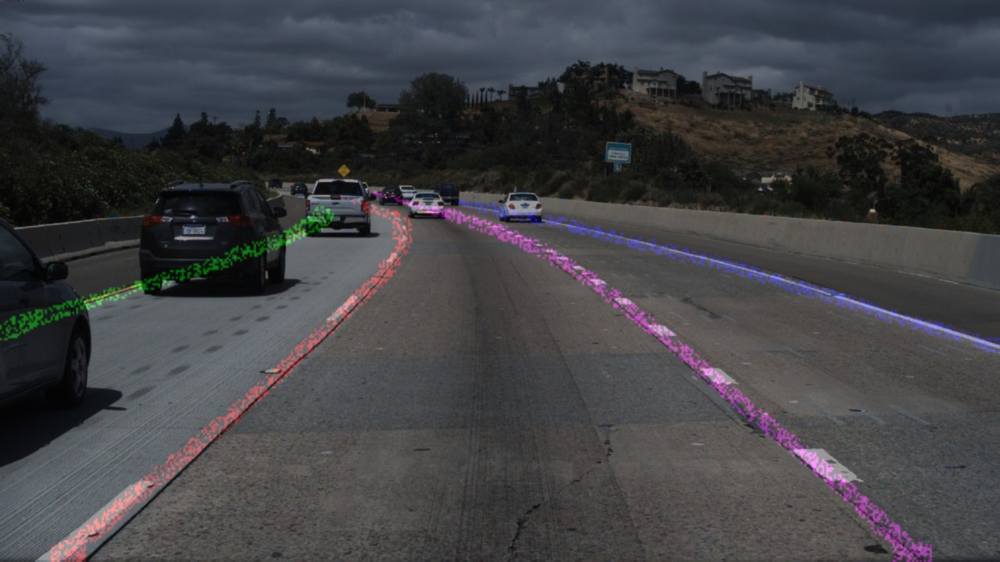

## 车道线检测模型LaneNet TensorRT加速

徐静

### 1.下载模型配置环境

1. 在官网下载预训练的模型，backbone为bisenetV2

2. 创建虚拟环境安装必要的包，因为tensorflow只作为测试我们预安装tensorflow而非tensorflow-gpu

   ```shell
   conda create -n tf15 python=3.7
   conda activate tf15
   pip install -r rqwuirements.txt -i https://pypi.tuna.tsinghua.edu.cn/simple
   ```


3. TensorRT 8.2.1.8

4. VS 2017

### 2.Tensorflow 2 TensorRT

鄙人研究发现，LaneNet 的TensorRT加速目前没有开源的C++实现，没有相关源码参考，需要自己搞了。特别是LaneNet项目时不时的会有更新，即使有相关参考项目也是比较老的版本，无法适应新的环境。

#1.冻结Tf图的变量

```shell
#需要找到input和output的结点然后冻结图
# 进入到lanenet的项目下，执行tools下的print_graph.py

conda activate tf15
python tools/print_graph.py
# 可以把网络结构存储在Tensorboad的log中，方便我们查看tf的网络节点，同时这个脚本也生成了pb文件

# 也可以用下面方式生成
python tools/freeze_graph.py

# 将在项目下生成lanenet.pb的freeze graph
```

#2.使用tf2onnx工具将模型转为onnx

我看有大佬准UFF也成功了，官方已经基本废弃UFF Parser了，tf转onnx trt官方推荐使用tf2onnx,因此我们选择这条路。

```shell
python -m tf2onnx.convert -h

# 方式1生成的pb转onnx
python -m tf2onnx.convert --input ./lanenet.pb --output ./lanenet.onnx --inputs input_tensor:0 --outputs LaneNet/bisenetv2_backend/instance_seg/pix_embedding_conv/pix_embedding_conv:0,LaneNet/bisenetv2_backend/binary_seg/ArgMax:0 --opset 11

# 成功在项目下生成lanenet.onnx

# 方式3生成的pb转onnx
python -m tf2onnx.convert --input ./lanenet.pb --output ./lanenet.onnx --inputs lanenet/input_tensor:0 --outputs lanenet/final_binary_output:0,lanenet/final_pixel_embedding_output:0 --opset 11

```

#3.ONNX序列化Engine

```shell
trtexec --onnx=lanenet.onnx --saveEngine=lanenet.engine --verbose
```

#4.恭喜你成功了！

在TensorRT-8.2.1.8/bin下生成了`lanenet.engine` 恭喜你，序列化engine成功了！！！

### 3.LaneNet TensorRT C++模型加速代码实现

+ 找到了网上聚类算法的开源实现
+ 后处理部分参考了LaneNet MNN实现的一些代码，并做了重构
+ TensorRT可以正常推断，后处理结果正确！！！

### 4.Demo

原图：


二值化mask:


车道线实例分割结果：



结果放在原图中：




### 5.TODO

[ ] 优化DBscan基于密度的聚类算法，使之更快！！！


